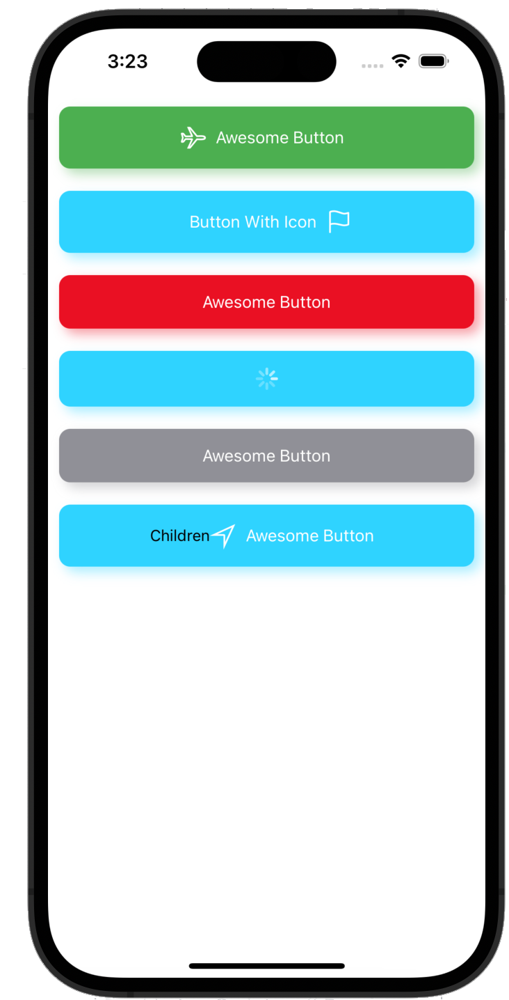

# Custom Button Component



This repository contains the source code for a custom button component created using React Native's own components, without relying on any third-party libraries. The code is part of a tutorial available on YouTube.

## Tutorial

[YouTube Tutorial: Build a Custom Button Component in React Native | No Third-Party Dependencies](https://youtu.be/prZ9qERn3w0)

The tutorial demonstrates how to create a custom button component using React Native's built-in components. You can follow along with the video to learn the process step by step.

# Usage:
```bash
git clone https://github.com/anwersolangi/Custom-Button-Component.git
```

# Contributing
Contributions are welcome! If you find any issues or have suggestions for improvements, feel free to open an issue or submit a pull request.

License
This project is licensed under the MIT License.
